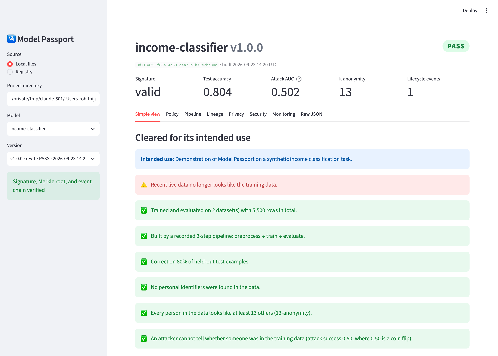
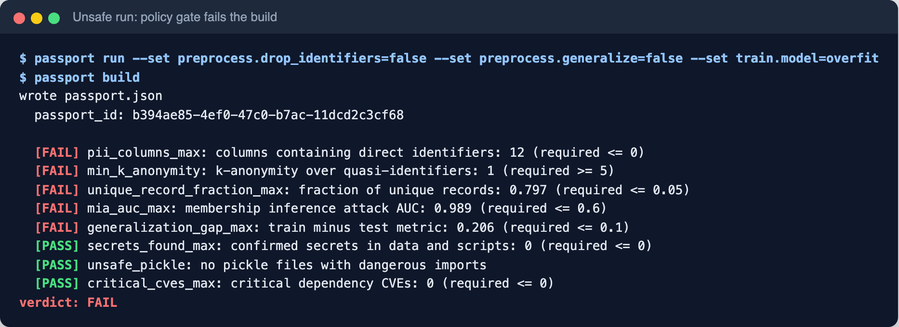
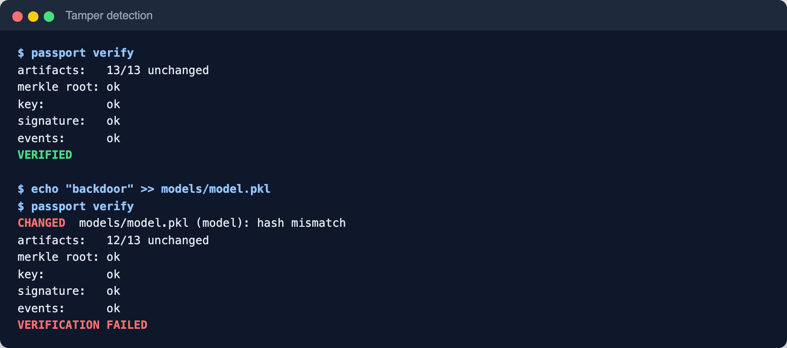
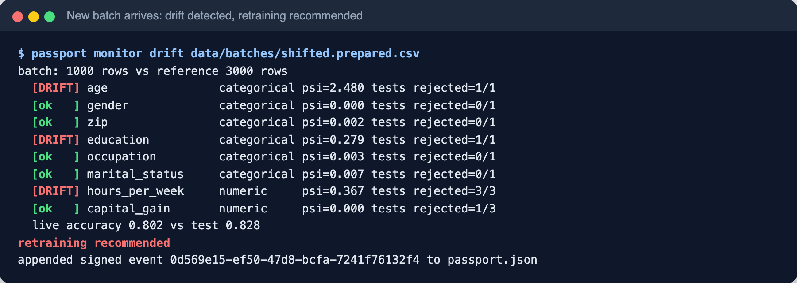
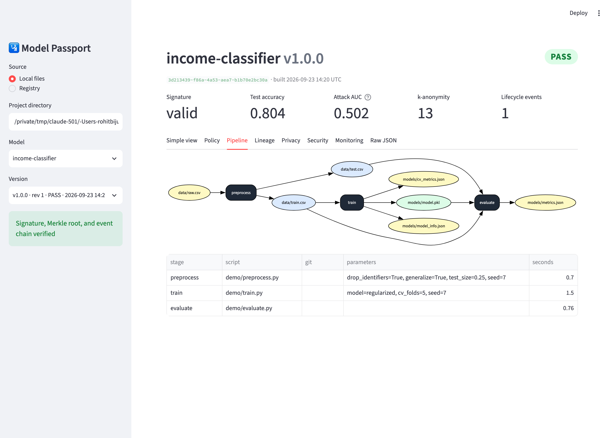
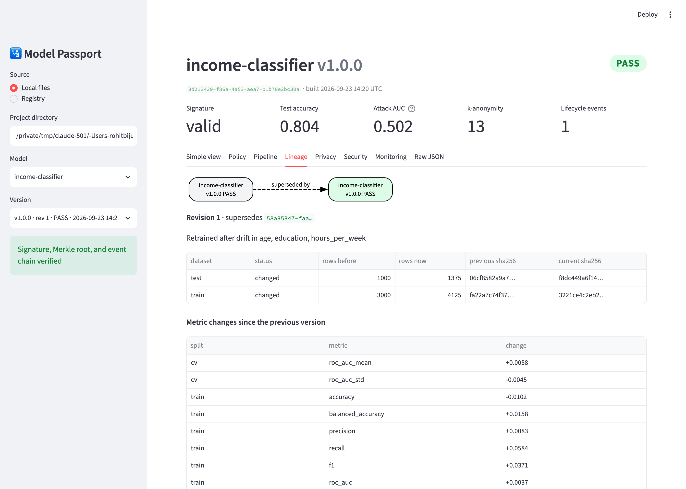
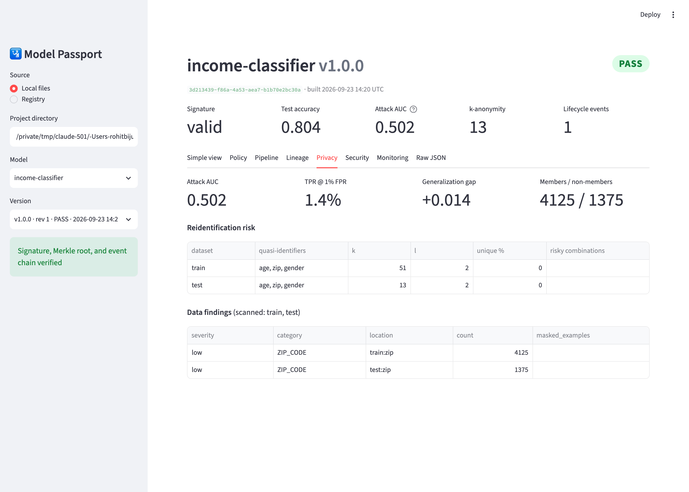
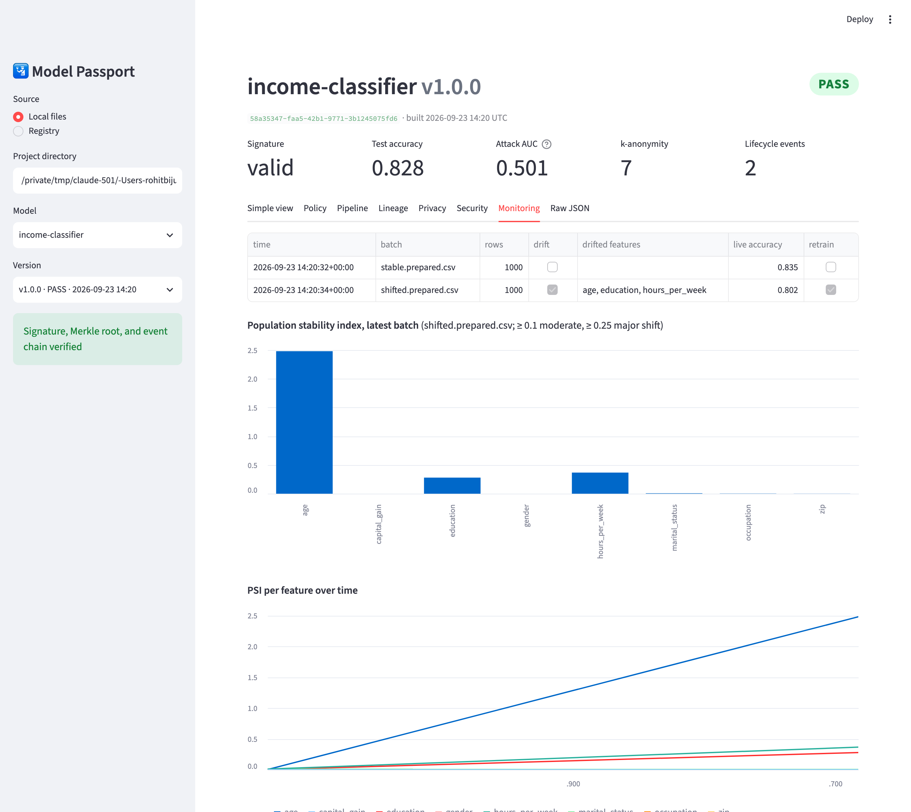
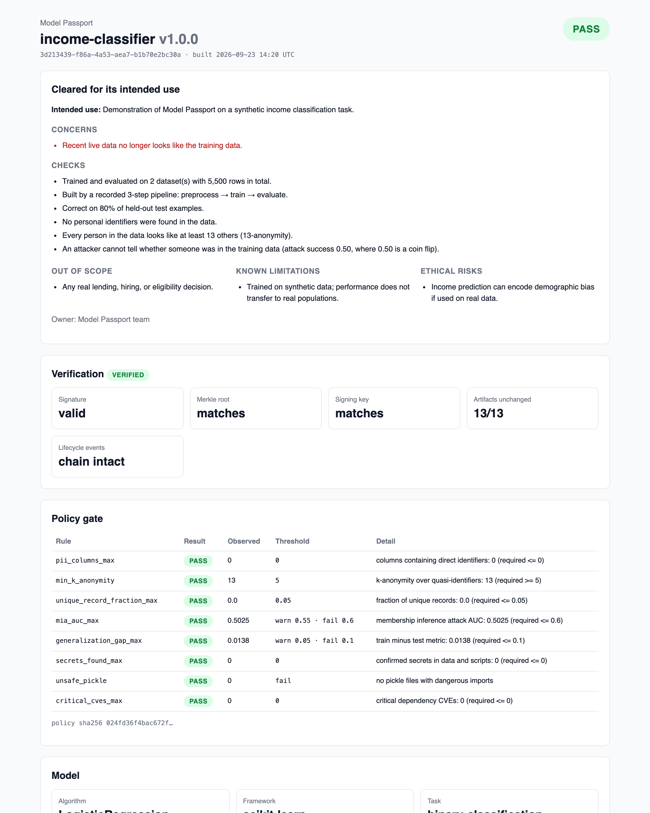
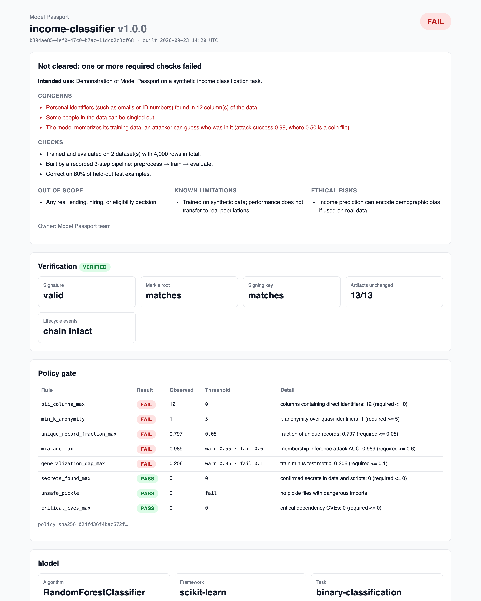

# Model Passport

[](https://github.com/r7bb/Model-Passport/actions/workflows/ci.yml)


Model Passport wraps an ML training pipeline and produces a signed, verifiable **passport** for every trained model. The passport records where the model came from (data, code, parameters, environment, metrics) and certifies that the training data and the trained model were checked for privacy and security problems. It is machine readable for CI and tools, and human readable for reviewers.

It extends the AIPassport framework (Kalokyri et al., [arXiv 2506.22358](https://arxiv.org/abs/2506.22358)) with:
- automated PII and reidentification scanning
- membership inference auditing
- artifact and dependency safety checks
- Ed25519 signatures over a Merkle root of all artifacts
- a CI policy gate
- signed drift-monitoring events for new and changing data

See [ROADMAP.md](ROADMAP.md) for status.



## What it catches

| Unsafe data and an overfit model fail the build | Any change to a certified artifact is named |
|---|---|
|  |  |

When new data arrives, `passport monitor drift` checks its schema, distribution (KS, Mann-Whitney U, Cramér-von Mises, chi-square, and PSI), and live accuracy. It appends a signed event and exits 1 when retraining is recommended:



## Setup

Requires Python 3.11+.

```bash
python3.11 -m venv .venv
.venv/bin/pip install -e ".[dev,demo,registry,dashboard]"
pre-commit install            # ruff, mypy --strict, and a secrets scan on every commit
```

Optional extras: `mlflow` (experiment tracking), `presidio` (free-text PII), `docs` (screenshot tooling).

## Quickstart

```bash
passport init --name my-model     # passport.yaml + Ed25519 keypair in .passport/ (gitignored)
# declare stages, datasets, and declared fields in passport.yaml
passport run                      # run stages; record scripts, params, inputs, outputs, git state
passport build                    # scan, audit, apply policy.yaml, sign -> passport.json + .html
passport verify passport.json     # exit 1 and name any changed file, bad signature, or broken event
```

`passport build` exits 1 when the policy verdict is **fail**, so CI can block a merge.

## The demo

The demo uses a synthetic census-style income dataset with injected fake PII (generated with Faker; no real people). The model's regularization strength is picked by stratified 5-fold grid search. Preprocessing sits inside the scikit-learn pipeline, so no statistics leak across folds. Evaluation reports accuracy against the majority-class baseline, plus balanced accuracy, F1, ROC AUC, log loss, and Brier score.

```bash
bash demo/update_cycle.sh    # certify, monitor stable and shifted batches, retrain, re-certify
```

Or step by step:

```bash
python demo/make_dataset.py && passport init

# Unsafe: keep identifiers, raw quasi-identifiers, overfit model -> FAIL
passport run --set preprocess.drop_identifiers=false --set preprocess.generalize=false \
             --set train.model=overfit
passport build

# Fixed: drop identifiers, generalize age and ZIP, cross-validated regularization -> PASS
passport run && passport build && passport verify

# New data: prepare a batch with the passport's recorded preprocessing, then monitor it
python demo/make_dataset.py --rows 1000 --seed 8 --drift 0.7 --out data/batches/week1.csv
python demo/prepare_batch.py data/batches/week1.csv --out data/batches/week1.prepared.csv
passport monitor drift data/batches/week1.prepared.csv

# Retrain on updated data; the new passport links to and archives the one it supersedes
python demo/make_dataset.py --rows 1500 --seed 9 --drift 0.7 --append data/raw.csv
passport run && passport build --reason "Retrained after drift"
```

## Dashboard and report

```bash
streamlit run dashboard/app.py                    # local passport.json and .passport/history
passport serve --db registry.db                   # FastAPI + SQLite; re-verifies every upload
passport push passport.json --registry http://localhost:8000
PASSPORT_REGISTRY_URL=http://localhost:8000 streamlit run dashboard/app.py
```

Link to a specific version with `?passport=<passport_id>`.

| Pipeline DAG | Lineage and what changed |
|---|---|
|  |  |
| **Privacy audit** | **Drift monitoring** |
|  |  |

`passport build` also writes a self-contained `passport.html`:

| PASS | FAIL |
|---|---|
|  |  |

Registry endpoints:
- `POST /passports` and `GET /passports`
- `GET /passports/{id}`, plus `/verify`, `/lineage`, `/dag`, `/html`, and `/jsonld`
- `POST /passports/{id}/events`

Set `PASSPORT_REGISTRY_TOKEN` to require a bearer token for writes.

## Full stack with Docker

```bash
cp .env.example .env    # then set real credentials
docker compose up -d --build
```

This runs MinIO (object store), MLflow (tracking, with artifacts in MinIO), the registry API (http://localhost:8000/docs), and the dashboard (http://localhost:8501). CI builds the whole stack and health-checks every service.

## Commands

| Command | Purpose |
|---|---|
| `init` | Config, signing keypair, .gitignore |
| `run [--set stage.key=value]` | Execute stages and capture provenance (optional MLflow and DVC) |
| `build [--reason] [--no-link]` | Scans, audits, policy gate, signing, HTML report, version linking |
| `verify` | Hashes, Merkle root, key fingerprint, signature, event chain |
| `report`, `export` | HTML report; JSON-LD (W3C PROV, DCAT, ML Schema) |
| `scan data`, `scan secrets` | PII and reidentification risk; credentials in files |
| `audit model`, `audit deps` | Membership inference and pickle safety; pip-audit with OSV severities |
| `monitor drift` | Schema, drift, and performance check appended as a signed event |
| `serve`, `push` | Registry API and upload |

## How verification works

- Every artifact (config, policy, model, datasets, scripts, stage inputs and outputs) is hashed with streamed SHA256 into the `artifacts` manifest.
- A Merkle root is computed over the sorted hashes, with domain-separated leaf and node hashes.
- The passport is canonicalized (sorted keys, no whitespace) and signed with Ed25519.
- Lifecycle events are excluded from that signature. Each event is signed on its own and hash-chained to the previous event, and the first one is anchored to the passport. Events can be appended but not edited, reordered, or moved to another passport.
- Findings never contain raw sensitive values, only counts, rates, and masked examples like `j***@e***.com`.

## Development

```bash
.venv/bin/pytest                       # 150+ tests, ~90% coverage
.venv/bin/ruff check . && .venv/bin/ruff format --check .
.venv/bin/mypy                         # strict
```

The HTML report is rendered by a small typed builder (`src/model_passport/report/html.py`) rather than a template engine. Every value is escaped unless it's explicitly marked safe, and mypy and ruff check the report code like everything else. The README images are regenerated from real runs with `scripts/screenshot.py` and `scripts/terminal_shot.py`.

Licensed under MIT ([LICENSE](LICENSE)); see [THIRD_PARTY_NOTICES.md](THIRD_PARTY_NOTICES.md).
