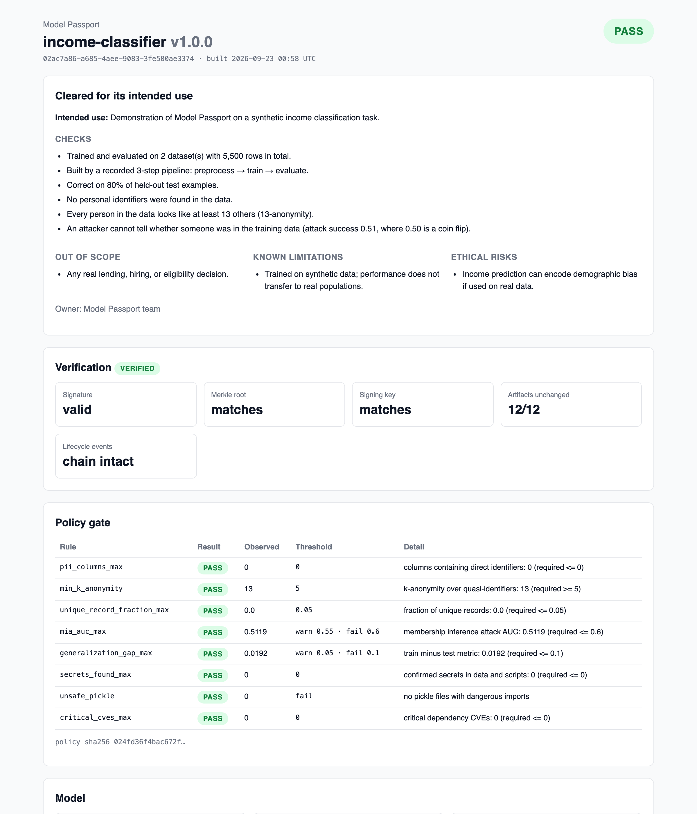

# Model Passport

Model Passport wraps an ML training pipeline and produces a signed, verifiable **passport** for every trained model. The passport records where the model came from (data, code, parameters, environment, metrics) and certifies that the training data and the trained model were checked for privacy and security problems. It is machine readable for CI and tools, and human readable for reviewers.

It extends the AIPassport framework (Kalokyri et al., [arXiv 2506.22358](https://arxiv.org/abs/2506.22358)) with automated PII and reidentification scanning, membership inference auditing, artifact and dependency safety checks, Ed25519 signatures over a Merkle root of all artifacts, a CI policy gate, and signed drift-monitoring events. See [ROADMAP.md](ROADMAP.md) for status.

| Dashboard (simple view) | HTML report |
|---|---|
|  |  |

## Setup

Requires Python 3.11+.

```bash
python3.11 -m venv .venv
.venv/bin/pip install -e ".[dev,demo,registry,dashboard]"
```

Optional extras: `mlflow` (experiment tracking), `presidio` (free-text PII), `docs` (screenshots).

## Quickstart

```bash
passport init --name my-model     # passport.yaml + Ed25519 keypair in .passport/ (gitignored)
# declare stages, datasets, and declared fields in passport.yaml
passport run                      # run stages; record scripts, params, inputs, outputs, git state
passport build                    # scan, audit, apply policy.yaml, sign -> passport.json + .html
passport verify passport.json     # exit 1 and name any changed file, bad signature, or broken event
```

`passport build` exits 1 when the policy verdict is **fail**, so CI can block a merge.

## The demo

A synthetic census-style income dataset with injected fake PII (Faker, no real people):

```bash
python demo/make_dataset.py
passport init

# 1. Unsafe: keep identifiers, raw quasi-identifiers, overfit model  -> verdict FAIL
passport run --set preprocess.drop_identifiers=false --set preprocess.generalize=false \
             --set train.model=overfit
passport build            # PII columns, k-anonymity 1, attack AUC ~0.98

# 2. Fixed: drop identifiers, generalize age and ZIP, regularize       -> verdict PASS
passport run && passport build && passport verify

# 3. Tamper with the model and watch verification fail
echo x >> models/model.pkl && passport verify
```

### New and changing data

```bash
# A new batch arrives: check schema, drift (KS, Mann-Whitney U, Cramér-von Mises, chi-square
# + PSI), and live accuracy. Appends a signed event; exits 1 when retraining is recommended.
python demo/make_dataset.py --rows 1000 --seed 8 --drift 0.7 --out data/batches/week1.csv
passport monitor drift data/batches/week1.csv     # batch must use the model's feature format

# Retrain on the updated data. The new passport links to the one it supersedes and records
# which datasets, artifacts, and metrics changed; the old one is archived with its events.
python demo/make_dataset.py --rows 1500 --seed 9 --drift 0.7 --append data/raw.csv
passport run && passport build --reason "Retrained after drift"
```

## Registry and dashboard

```bash
passport serve --db registry.db                  # FastAPI + SQLite; re-verifies every upload
passport push passport.json --registry http://localhost:8000
PASSPORT_REGISTRY_URL=http://localhost:8000 streamlit run dashboard/app.py
```

Endpoints: `POST /passports`, `GET /passports`, `GET /passports/{id}` (plus `/verify`, `/lineage`, `/dag`, `/html`, `/jsonld`), `POST /passports/{id}/events`. Set `PASSPORT_REGISTRY_TOKEN` to require a bearer token for writes.

## Commands

| Command | Purpose |
|---|---|
| `init` | Config, signing keypair, .gitignore |
| `run [--set stage.key=value]` | Execute stages and capture provenance (optional MLflow and DVC) |
| `build [--reason] [--no-link]` | Scans, audits, policy gate, signing, HTML report, version linking |
| `verify` | Hashes, Merkle root, key fingerprint, signature, event chain |
| `report`, `export` | HTML report; JSON-LD (W3C PROV, DCAT, ML Schema) |
| `scan data`, `scan secrets` | PII and reidentification risk; credentials in files |
| `audit model`, `audit deps` | Membership inference and pickle safety; pip-audit with OSV severities |
| `monitor drift` | Drift, schema, and performance check appended as a signed event |
| `serve`, `push` | Registry API and upload |

## How verification works

- Every artifact (config, policy, model, datasets, scripts, stage inputs and outputs) is hashed with streamed SHA256 into the `artifacts` manifest.
- A Merkle root is computed over the sorted hashes with domain-separated leaves and nodes.
- The passport is canonicalized (sorted keys, no whitespace) and signed with Ed25519. Lifecycle events are excluded from that signature: each one is signed individually and hash-chained to the previous event, and the first is anchored to the passport, so events can be appended but not edited, reordered, or moved.
- Findings never contain raw sensitive values: only counts, rates, and masked examples like `j***@e***.com`.

## Development

```bash
.venv/bin/pytest
.venv/bin/ruff check . && .venv/bin/ruff format --check .
```

Licensed under MIT ([LICENSE](LICENSE)); see [THIRD_PARTY_NOTICES.md](THIRD_PARTY_NOTICES.md).
